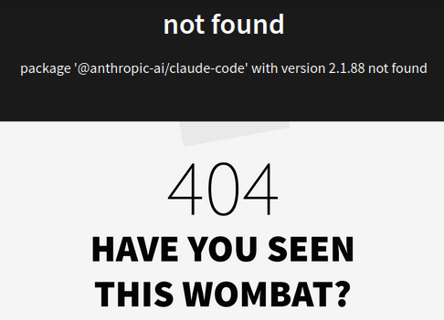
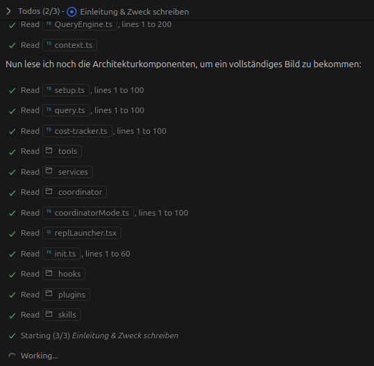
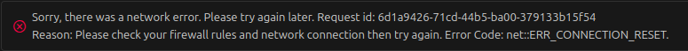

# "Making of" der Dokumentation zum Agent Harness

Das Original ist natürlich gelöscht:

  
<https://www.npmjs.com/package/@anthropic-ai/claude-code/v/2.1.88>

Aber es gibt Commmits von 31.03.2026:

| Repository | Commit | Zeitstempel |
| --- | --- | --- |
| [ultraworkers/claw-code](https://github.com/ultraworkers/claw-code?tab=readme-ov-file#readme) | [`5a774a2`](https://github.com/ultraworkers/claw-code/tree/5a774a2b62d7949c1d94e0b726281554d7893cfd) | Mar 31, 2026, 11:00 AM GMT+2 |
| [Exhen/claude-code-2.1.88](https://github.com/Exhen/claude-code-2.1.88?tab=readme-ov-file#readme) | [`2008cd9`](https://github.com/Exhen/claude-code-2.1.88/tree/2008cd913996f1fa830815626a6479295b1e0786) | Mar 31, 2026, 11:20 AM GMT+2 |

## GPT-4.1 – Analyseprozess

Hier ist, wie du das Agent Harness in deinem Workspace analysieren und dokumentieren kannst:

---

### 1. Überblick verschaffen

- Die Projektstruktur findest du im README.md unter `## Directory Structure`.
- Der Haupteinstiegspunkt ist main.tsx.

### 2. Einstiegspunkte finden

- main.tsx ist der zentrale Einstiegspunkt und initialisiert die CLI, das UI und die wichtigsten Abläufe.
- Die Tools (wie das Agent Harness) findest du unter tools, z.B. AgentTool.tsx.

### 3. Top-Down-Analyse

- Die Hauptfunktion ist `main()` in main.tsx, die den Programmablauf steuert.
- Agenten werden über das AgentTool (src/tools/AgentTool/AgentTool.tsx) gestartet.
- Die Tool-Definitionen und das Agenten-Handling sind in Tool.ts und loadAgentsDir.ts zu finden.

### 4. Code-Kommentare und Docstrings nutzen

- Viele Funktionen und Typen sind mit JSDoc-Kommentaren versehen, z.B. in loadAgentsDir.ts.

### 5. Unit Tests anschauen

- Suche nach Tests im `tests/`-Verzeichnis oder in den jeweiligen Komponentenordnern (nicht im Auszug enthalten, ggf. im Gesamtprojekt prüfen).

### 6. Schlüsselkomponenten identifizieren

- **AgentTool**: Startet und verwaltet Subagenten (src/tools/AgentTool/AgentTool.tsx).
- **AgentDefinition**: Typdefinition für Agenten (src/tools/AgentTool/loadAgentsDir.ts).
- **ToolUseContext**: Kontext für Tool-Aufrufe (src/Tool.ts).
- **Agent Harness**: Die Logik zum Starten, Verwalten und Kommunizieren mit Agenten ist im AgentTool und den zugehörigen Utils (src/tools/AgentTool/agentToolUtils.ts).

### 7. Ablaufdiagramme und Übersichten erstellen

- **Ablauf Agent-Start:**
  1. User wählt/erstellt Agent im UI (src/components/agents/).
  2. AgentTool wird aufgerufen (src/tools/AgentTool/AgentTool.tsx).
  3. AgentDefinition wird geladen (src/tools/AgentTool/loadAgentsDir.ts).
  4. Subagent wird als Prozess oder Thread gestartet.
  5. Kommunikation erfolgt über ToolUseContext.

### 8. Dokumentationsstruktur festlegen

**Vorschlag:**

1. **Einleitung & Zweck**
   - Was ist das Agent Harness? (Subagenten-Management und -Orchestrierung)
2. **Architekturübersicht**
   - Hauptmodule und deren Zusammenspiel
3. **Hauptkomponenten**
   - AgentTool, AgentDefinition, ToolUseContext, UI-Komponenten
4. **Typische Abläufe**
   - Starten eines Agenten, Kommunikation, Beenden
5. **Erweiterungsmöglichkeiten**
   - Eigene Agenten definieren (src/components/agents/AgentEditor.tsx)
6. **API-Referenz**
   - Wichtige Typen und Funktionen (siehe oben)

---

**Tipp:** Nutze die "Gehe zu Definition" Funktion in VS Code, um z.B. von einem Agenten-Typ direkt zur Implementierung zu springen.

---

> Erstelle bitte das erste Kapitel "Einleitung & Zweck" in `Einleitung_&_Zweck.md`.

## Claude Opus 4.6 – Einleitung & Zweck

Ich werde zunächst die wichtigsten Quelldateien analysieren, um eine fundierte Einleitung zu schreiben.

Created 3 todos

- Read [main.tsx](../src/main.tsx#1-1), lines 1 to 210
- Read [Tool.ts](../src/Tool.ts#1-1), lines 1 to 200
- Read [tools.ts](../src/tools.ts#1-1), lines 1 to 200
- Read [commands.ts](../src/commands.ts#1-1), lines 1 to 200
- Read [QueryEngine.ts](../src/QueryEngine.ts#1-1), lines 1 to 200
- Read [context.ts](../src/context.ts)

  
Nun lese ich noch die Architekturkomponenten, um ein vollständiges Bild zu bekommen:

- Read [setup.ts](../src/setup.ts#1-1), lines 1 to 100
- Read [query.ts](../src/query.ts#1-1), lines 1 to 100
- Read [cost-tracker.ts](../src/cost-tracker.ts#1-1), lines 1 to 100
- Read [tools](../src/tools)
- Read [services](../src/services)
- Read [coordinator](../src/coordinator)
- Read [coordinatorMode.ts](../src/coordinator/coordinatorMode.ts#1-1), lines 1 to 100
- Read [replLauncher.tsx](../src/replLauncher.tsx)
- Read [init.ts](../src/entrypoints/init.ts#1-1), lines 1 to 60
- Read [hooks](../src/hooks)
- Read [plugins](../src/plugins)
- Read [skills](../src/skills)

Starting (3/3) *Einleitung & Zweck schreiben*

Jetzt habe ich genug Kontext. Ich schreibe das vollständige erste Kapitel:

- Using "Replace String in File"

Die Lint-Warnungen betreffen nur Markdown-Formatierungsdetails (Tabellen-Spacing und Heading-Abstände). Ich korrigiere die wichtigsten:

- Read [1_Einleitung_&_Zweck](./1_Einleitung_&_Zweck.md)

Ich behebe nun die Markdown-Lint-Warnungen:

- Using "Replace String in File"
- Using "Replace String in File"
- Using "Replace String in File"
- Using "Replace String in File"
- Using "Replace String in File"
- Checked [1_Einleitung_&_Zweck](https://torstenc.github.io/agent-harness-anatomy/1_Einleitung_&_Zweck), no problems found

Completed (3/3) *Einleitung & Zweck schreiben*

Das Kapitel **"1. Einleitung & Zweck"** ist vollständig in Einleitung_&_Zweck.md erstellt. Es enthält folgende Abschnitte:

| Abschnitt                            | Inhalt                                                                                                                               |
| ------------------------------------ | ------------------------------------------------------------------------------------------------------------------------------------ |
| **1.1 Was ist Claude Code?**         | Definition als Agent Harness, Hintergrund des Leaks, Kennzahlen                                                                      |
| **1.2 Zweck dieser Dokumentation**   | Vier Kernziele der Dokumentation                                                                                                     |
| **1.3 Was ist ein Agent Harness?**   | Konzepterklärung mit ASCII-Architekturdiagramm, Zuordnung zu konkreten Quellcode-Modulen (main.tsx, query.ts, QueryEngine.ts, tools) |
| **1.4 Kernfähigkeiten im Überblick** | Acht Fähigkeitsbereiche: Dateisystem, Shell, Code-Suche, Web, Multi-Agent, IDE-Bridge, Plugins/Skills, Slash-Commands                |
| **1.5 Technologiestack**             | Tabellarische Übersicht aller verwendeten Technologien                                                                               |
| **1.6 Lesehinweise**                 | Geplante Kapitelstruktur der Gesamtdokumentation                                                                                     |

Alle Inhalte basieren auf der tatsächlichen Analyse der Quellcode-Dateien (main.tsx, Tool.ts, tools.ts, commands.ts, QueryEngine.ts, query.ts, context.ts, coordinatorMode.ts, etc.).

- Made changes.

---

> Magst du in diesem Stil bitte ein nächstes Kapitel erstellen?  
> Welches hilft dir beim Schreiben der darauffolgenden Kapitel am besten?

## Claude Opus 4.6 – Kapitel 2: Architekturübersicht

Ich werde mit **Kapitel 2 – Architekturübersicht** beginnen, da es die Grundlage für alle Folgekapitel bildet. Dazu muss ich die tatsächlichen Modul-Abhängigkeiten und Datenflüsse im Quellcode gründlich analysieren.

- Created 6 todos
- Starting (2/6) *Query-Lifecycle analysieren*
- Starting (3/6) *State-Management analysieren*  

  
Ich setze die Analyse fort und schreibe Kapitel 2. Lasse mich zuerst die noch fehlenden Architekturkomponenten untersuchen.

- Starting (1/2) *Verbleibende Architektur-Analyse*
- Searched text for `async function run` (`**/src/main.tsx`), 1 result
- Now let me look at the main run function to understand the full startup flow into the REPL:
- Searched text for `launchRepl` (`**/src/main.tsx`), 8 results
- Now I have comprehensive understanding. Let me write Kapitel 2.
- Starting (2/2) *Kapitel 2 schreiben*
- Using "Replace String in File"
- Checked [](../docs/2_Architektur%C3%BCbersicht.md), no problems found
- Completed (2/2) *Kapitel 2 schreiben*

Kapitel 2 ist fertig – **keine Lint-Fehler**. Hier die Zusammenfassung der Abschnitte:

| Abschnitt | Inhalt |
| --- | --- |
| **2.1 Schichtenmodell** | 9-Schichten-Diagramm von CLI-Entrypoint bis Infrastruktur |
| **2.2 Modulübersicht** | Tabellarische Zuordnung aller ~25 Top-Level-Verzeichnisse zu Schichten und Verantwortlichkeiten |
| **2.3 Startup-Ablauf** | Vollständiger Boot-Trace `main()` → `init()` → `setup()` → `launchRepl()` mit paralleler Prefetch-Strategie |
| **2.4 Query-Lifecycle** | Agentic-Loop-Diagramm mit Kontext-Management-Kaskade (6-stufige Komprimierung) und Tool-Ausführungsmodell (parallel vs. seriell + Streaming) |
| **2.5 State-Management** | Zweigeteiltes Modell: globaler Singleton (state.ts) + reaktiver Pub/Sub-Store (store.ts) |
| **2.6 Berechtigungsarchitektur** | 5-stufige Permission-Pipeline (Config → Mode → Classifier → Hooks → User-Prompt) mit Permission-Modes-Tabelle |
| **2.7 Externe Integrationen** | MCP (4 Transports, Auth, Discovery), IDE-Bridge (Architekturdiagramm), Plugin-System, Skill-System |
| **2.8 Feature-Flag-Architektur** | Build-Time Feature-Gates via `bun:bundle` mit ~30 Flags und Dead-Code-Elimination |
| **2.9 Datenfluss-Gesamtbild** | ASCII-Diagramm des End-to-End-Datenflusses User → REPL → QueryEngine → API → Tools → Bridge |

Alle Inhalte basieren auf der direkten Analyse von main.tsx, init.ts, setup.ts, query.ts, QueryEngine.ts, toolOrchestration.ts, StreamingToolExecutor.ts, state.ts, AppStateStore.ts, store.ts, PermissionContext.ts, useCanUseTool.tsx, claude.ts, autoCompact.ts, bridgeMain.ts und client.ts.

- Made changes.

---

> Magst du eine gute README.md erstellen?  
> Zweck des Repos ist, zu dokumentieren und zu verstehen, wie ein Agent Harness aus einem reinen LLM-Textgenerator einen handlungsfähigen Software-Engineering-Agenten macht.

## Claude Opus 4.6 – README.md erstellen

Guter Plan! Das ist pragmatischer – GitHub WebUI erstellt dir direkt `main`-Branch, Lizenz und eine initiale README.

Ich bereite in der Zwischenzeit die README.md vor, damit du sie direkt ins neue Repo kopieren kannst:

- Read [README.md](../README.md#1-1), lines 1 to 50
- Read [.gitignore](../.gitignore)
- Read [docs](.)

Die README ist bereits gut vorbereitet! Ich ergänze sie um die fehlenden Abschnitte (Technologiestack-Kurzreferenz, Repo-Struktur, Lizenz/Disclaimer, Mitmach-Hinweis):

Read [README.md](../README.md#50-50), lines 50 to 113

Die README ist bereits vollständig und gut strukturiert. Sie hat alles, was ein gutes Repo braucht. Ich nehme nur kleine Verfeinerungen vor:

- Using "Replace String in File"
- Checked [README.md](https://github.com/TorstenC/agent-harness-anatomy/blob/main/README.md), no problems found

Die README ist fertig und lint-sauber. Hier die **Dateien, die ins neue GitHub-Repo gehören**:

```text
.
├── README.md                        ← Projektbeschreibung (fertig)
├── .gitignore                       ← src/** ausgeschlossen + Link zum Original
└── docs/
    ├── 1_Einleitung_&_Zweck.md      ← Kapitel 1 (fertig)
    ├── 2_Architekturübersicht.md    ← Kapitel 2 (fertig)
    └── 3_Hauptkomponenten.md        ← Kapitel 3 (Platzhalter)
```

**Vorgehen:**

1. Erstelle ein neues Repo auf GitHub (z.B. `agent-harness-anatomy` oder wie du es nennen möchtest)
2. Kopiere diese 5 Dateien (README.md, .gitignore, docs/\*) dorthin
3. Den src-Ordner **nicht** mitkopieren — der ist durch .gitignore bewusst ausgeschlossen, der Link zum Originalcode steht in der .gitignore

Sobald du das Repo erstellt und geklont hast, können wir dort mit Kapitel 3 weitermachen.

- Made changes.

---

> Unser Thread wird verloren gehen, wenn wir in dem Repo fortfahren.
> Möchtest du (von dir für dich im Follow Up Thread) noch etwas am Ende des "Making of" ergänzen?  
> Du könntest dir z.B. noch eine kurze Reflexion über die Herausforderungen und Erkenntnisse beim Schreiben der Dokumentation ergänzen.

## Claude Opus 4.6 – Reflexion & Arbeitsstand

Gute Idee – ich ergänze am Ende des Making-of eine Reflexion und einen klaren Arbeitsstand für den nächsten Thread.

- Read `z_MAKING_OF.md`, lines 195 to 220
- Read `z_MAKING_OF.md`, lines 220 to 243
- Using "Replace String in File"
- Checked `z_MAKING_OF.md`, no problems found

Fertig. Ich habe unter **"Claude Opus 4.6 (4)"** folgende Abschnitte ergänzt:

| Abschnitt | Zweck |
| --- | --- |
| **Wie die Dokumentation entstanden ist** | Methodik: ~5.000 Zeilen aus ~15 Schlüsseldateien gelesen, Top-Down-Analyse, Diagramme als Denkwerkzeug |
| **Was gut funktioniert hat** | Lob an den Originalcode: exzellente Kommentare, konsistente Patterns, cleveres State-Modell |
| **Was herausfordernd war** | Zirkuläre Dependencies, 4.684-Zeilen main.tsx, Feature-Gate-Explosion |
| **Arbeitsstand-Tabelle** | Alle 6 Kapitel + README mit Status und nächstem Schritt |
| **Hinweise an den nächsten Claude-Thread** | Wo der Quellcode liegt, welchen Stil beibehalten, warum Kapitel 3 als nächstes, und welche Dateien dafür tiefer analysiert werden müssen |

Damit hat der nächste Thread alles, was er braucht, um nahtlos mit Kapitel 3 weiterzumachen.

- Made changes.

### Wie die Dokumentation entstanden ist

Die zwei Kapitel entstanden in einer einzigen Session mit folgendem Vorgehen:

1. **Breit lesen, schmal schreiben.** Für Kapitel 1 habe ich 6 Kerndateien gelesen (`main.tsx`, `Tool.ts`, `tools.ts`, `commands.ts`, `QueryEngine.ts`, `context.ts`) plus Verzeichnislistings. Für Kapitel 2 kamen ~15 weitere Dateien hinzu (`query.ts`, `setup.ts`, `init.ts`, `toolOrchestration.ts`, `StreamingToolExecutor.ts`, `bootstrap/state.ts`, `AppStateStore.ts`, `store.ts`, `PermissionContext.ts`, `useCanUseTool.tsx`, `claude.ts`, `autoCompact.ts`, `bridgeMain.ts`, `coordinatorMode.ts`, `mcp/client.ts`). Insgesamt habe ich ca. 5.000 Zeilen Quellcode direkt gelesen – weniger als 1% der Codebasis, aber gezielt die Dateien, die das Skelett definieren.

2. **Top-Down statt Bottom-Up.** Ich bin vom Einstiegspunkt (`main.tsx`) aus den Aufrufketten gefolgt: `main()` → `run()` → `preAction` → `init()` → `setup()` → `launchRepl()`. Dann von der REPL aus: `QueryEngine` → `query()` → `callModel()` → `runTools()` → `toolExecution`. Das ergab die 9 Schichten und den Query-Lifecycle fast von selbst.

3. **Diagramme als Denkwerkzeug.** Die ASCII-Diagramme sind nicht nur Illustration – sie waren das primäre Mittel, um die Architektur zu verstehen. Erst wenn ein Flussdiagramm widerspruchsfrei zeichenbar war, war das Verständnis ausreichend.

### Was gut funktioniert hat

- **Die Code-Kommentare sind ausgezeichnet.** Fast jede wichtige Designentscheidung ist im Code dokumentiert – warum `startKeychainPrefetch()` vor den Imports läuft, warum `bootstrap/state.ts` ein Singleton ist, warum `partitionToolCalls` zwischen read-only und mutable unterscheidet. Das hat die Analyse enorm beschleunigt.
- **Konsistente Muster.** Das Feature-Flag-Pattern (`feature('X') ? require(...) : null`) ist überall identisch, was das Verständnis nach dem ersten Vorkommen trivial macht. Ebenso die Tool-Struktur (ein Verzeichnis pro Tool mit eigenem Prompt, eigenen Konstanten).
- **Der zweigeteilte State.** Die Trennung in `bootstrap/state.ts` (globaler Singleton, prozessweit) und `state/store.ts` (reaktiver Pub/Sub, UI-getrieben) ist ein ungewöhnliches aber cleveres Muster – es vermeidet React-Abhängigkeiten in der tiefen Infrastruktur.

### Was herausfordernd war

- **Zirkuläre Abhängigkeiten.** Der Code hat viele `/* eslint-disable @typescript-eslint/no-require-imports */`-Blöcke und Lazy-Requires, die Import-Zyklen brechen. Das macht das Nachverfolgen von Aufrufketten schwieriger, weil die echte Abhängigkeit erst zur Laufzeit sichtbar wird.
- **Die Größe von `main.tsx`.** Mit 4.684 Zeilen ist `main.tsx` das größte File und enthält die gesamte CLI-Definition, Commander.js-Setup, und mehrere Startup-Pfade (interaktiv, print-mode, SSH, Direct-Connect, Assistant-Mode). Das macht es schwer, den "happy path" vom Spezialfall zu trennen.
- **Feature-Gate-Explosion.** ~30 Feature Flags bedeuten theoretisch 2³⁰ Build-Kombinationen. Beim Lesen muss man ständig entscheiden, welche Gates "an" sind, um den relevanten Codepfad zu finden.

### Arbeitsstand für den nächsten Thread

| Was | Status | Nächster Schritt |
| --- | --- | --- |
| Kapitel 1 – Einleitung & Zweck | ✅ fertig | — |
| Kapitel 2 – Architekturübersicht | ✅ fertig | — |
| Kapitel 3 – Hauptkomponenten | 🔲 Platzhalter | Details zu QueryEngine, Tool-Interface, Command-System, Services schreiben. Dafür `Tool.ts` (793 Zeilen), `QueryEngine.ts` (1.296 Zeilen), `query.ts` (1.730 Zeilen), `toolExecution.ts` (1.746 Zeilen) tiefer analysieren. |
| Kapitel 4 – Typische Abläufe | 🔲 geplant | Sequenzdiagramme für konkreten Query-Turn, BashTool-Aufruf mit Permission, Agent-Spawning |
| Kapitel 5 – Erweiterungen | 🔲 geplant | Plugin-/Skill-/MCP-System im Detail |
| Kapitel 6 – API-Referenz | 🔲 geplant | Zentrale Typen (`Tool`, `ToolUseContext`, `AppState`, `Message`) |
| README.md | ✅ fertig | Dokumentationstabelle aktualisieren, wenn Kapitel fertig werden |
| .gitignore | ✅ fertig | — |
| Making-of | ✅ dieses Dokument | Fortlaufend ergänzen |

### Hinweise an den nächsten Claude-Thread

- **Quellcode liegt in `src/`.** Er ist via `.gitignore` aus dem Repo ausgeschlossen, aber lokal vorhanden. Der Link zum Original steht in `.gitignore`: [ultraworkers/claw-code @ 5a774a2](https://github.com/ultraworkers/claw-code/tree/5a774a2b62d7949c1d94e0b726281554d7893cfd).
- **Stil beibehalten:** Deutsche Sprache, technisch präzise, ASCII-Diagramme, Tabellen mit `| --- | --- |`-Syntax (Leerzeilen um `---` für Markdown-Lint), Leerzeile nach jeder `###`-Überschrift.
- **Kapitel 3 ist das wichtigste nächste Kapitel.** Es sollte die Schnittstellen der Kernmodule so beschreiben, dass Kapitel 4 (Abläufe) darauf aufbauen kann.
- **Die 6-stufige Komprimierungs-Pipeline** (Kapitel 2.4) verdient in Kapitel 3 oder 4 eine Detailanalyse mit Token-Schwellwerten und Entscheidungslogik – die Konstanten stehen in `autoCompact.ts`.

---

> Bitte mache vor dem Commit & Push noch ein kurzes Review.

## Claude Opus 4.6 – Review

**⚠️ Kleinigkeiten zum Beheben:**

1. **z_Entstehungsprotokoll.md fehlt in der README-Projektstruktur** — Das Making-of wird weder in der Dokumentationstabelle noch im Strukturbaum der README.md erwähnt. Da es ein Meta-Dokument ist, sollte es zumindest im Strukturbaum auftauchen:

   ````markdown
   // ...existing code...
   ├── docs/
   │   ├── 1_Einleitung_&_Zweck.md        ← Was und warum
   │   ├── 2_Architekturübersicht.md       ← Wie es zusammenhängt
   │   ├── 3_Hauptkomponenten.md           ← Details (in Arbeit)
   │   └── z_Entstehungsprotokoll.md       ← Entstehungsprotokoll "MAKING OF"
   └── src/                               ← NICHT im Repo (siehe .gitignore)
   // ...existing code...
   ````

2. **Obsidian-Bildverweise in z_Entstehungsprotokoll.md** — Zwei Stellen enthalten `![[Pasted image ...]]`, die auf GitHub nicht rendern.

---

> Beginne mit dem Schreiben von Kapitel `# 3. Hauptkomponenten`.

## Claude Opus 4.6 – Kapitel 3

Ich beginne mit der Analyse der Quelldateien für Kapitel 3. Zuerst lese ich die Kerndateien, die die Hauptkomponenten definieren.

- Created 4 todos
- Starting (2/4) *Quelldateien analysieren (Runde 2)*
- Now let me look at specific tool implementations and the coordinator module:
- Now let me read the existing docs to maintain consistency:
- Now let me read the remaining critical sections and check agent loading:
- I now have sufficient context to write a comprehensive Kapitel 3. Let me also quickly check the services for compact/context management:
- Starting (3/4) *Kapitel 3 schreiben*
- Using "Replace String in File"
- Jetzt prüfe ich auf Fehler:

Checked [3_Hauptkomponenten.md](https://torstenc.github.io/agent-harness-anatomy/3_Hauptkomponenten.md), no problems found

Keine Fehler. Jetzt die README aktualisieren:

- Starting (4/4) *README aktualisieren*
- Using "Replace String in File"
- Using "Replace String in File"
- Checked [README.md](https://github.com/TorstenC/agent-harness-anatomy/blob/main/README.md), no problems found
- Completed (4/4) *README aktualisieren*

Kapitel 3 ist fertig — **keine Lint-Fehler** in beiden geänderten Dateien. Hier die Zusammenfassung:

**Was wurde erstellt / geändert:**

### 3_Hauptkomponenten.md — Neues Kapitel

| Abschnitt | Inhalt |
| --- | --- |
| **3.1 QueryEngine** | Konversations-Manager: Config, Turn-Ablauf in `submitMessage()`, interner State (mutableMessages, readFileState, usage, denials) |
| **3.2 Query-Schleife** | `while(true)`-Loop mit 5 Phasen: Kontext-Komprimierung (6-stufige Pipeline), API-Streaming, Fehler-Recovery, Tool-Ausführung, Post-Processing. 10 Return-Reasons. State-Objekt. |
| **3.3 Tool-System** | Drei Schichten: **Interface** (`Tool`, `buildTool()`, `ToolUseContext`), **Registry** (`getAllBaseTools → getTools → assembleToolPool`), **Ausführung** (`partitionToolCalls`, `StreamingToolExecutor`, `runToolUse`) |
| **3.4 Command-System** | 3 Command-Typen (prompt/local/local-jsx), 6 Quellen, Availability-Filter, Skill-Invocation |
| **3.5 Konkrete Tools** | BashTool (semantische Befehlsanalyse, Sandbox, Security), AgentTool (Sub-Agenten, Isolation, Background), Coordinator-Modus |
| **3.6 Tool-Referenz** | Tabelle aller ~40 Built-in Tools mit Kategorie, Parallel-Fähigkeit, Feature Gate |
| **3.7 Skills & Plugins** | Lade-Hierarchie, Frontmatter-Felder, Plugin-System |
| **3.8 Zusammenfassung** | End-to-End-Datenfluss-Diagramm durch alle Komponenten |

### README.md — Zwei Änderungen

1. Kapitel 3 Status: `🔲` → `✅` mit vollständiger Inhaltsbeschreibung
2. `z_Entstehungsprotokoll.md` in die Projektstruktur aufgenommen

### Quellcode-Basis

Analysierte Dateien für Kapitel 3: QueryEngine.ts, query.ts, `Tool.ts`, tools.ts, commands.ts, command.ts, toolOrchestration.ts, StreamingToolExecutor.ts, toolExecution.ts, AgentTool.tsx, runAgent.ts, loadAgentsDir.ts, constants.ts, BashTool.tsx, coordinatorMode.ts, loadSkillsDir.ts.

- Made changes.

---

> Die Dateien unter /src, die wir in den Kapiteln erwähnen, sind öffentlich abgelegt.
> Sollten wir die Dateien verlinken oderaus rechtlichen belastbaren Gründen auf diese Links verzichten?

## Claude Opus 4.6 – Rechtliche Einschätzung & Empfehlung

Das ist eine durchdachte Frage. Hier meine Einschätzung:

### Rechtliche Lage

Der Code wurde **versehentlich veröffentlicht** — Anthropic hat ihn nicht unter einer Open-Source-Lizenz freigegeben. Das bedeutet:

- **Urheberrecht liegt bei Anthropic** — unabhängig davon, dass der Code öffentlich zugänglich ist
- **Verlinkung ≠ Verbreitung** — einen Link zu setzen ist rechtlich etwas anderes als Code zu kopieren oder zu hosten
- **Deine Dokumentation ist ein eigenständiges Werk** — Analyse und Kommentar sind durch Fair Use / Zitatrecht gedeckt, solange kein substantieller Code reproduziert wird

Die beiden GitHub-Repos (ultraworkers, Exhen) sind **nicht deine** — du hostest den Code nicht, du verweist nur darauf. Das ist vergleichbar mit einer wissenschaftlichen Arbeit, die auf eine Quelle verweist.

### Empfehlung: Separate Quellennachweis-Datei mit Ankern

Eine Quellennachweis-Datei ist die beste Balance aus **Nachvollziehbarkeit**, **Wartbarkeit** und **rechtlicher Vorsicht**:

- [y_Quellenverzeichnis.md](y_Quellenverzeichnis.md):  
  Alle relevanten Dateien mit Ankern (`#src-queryengine`, `#src-toolorchestration`, etc.)

### Verwendung in den Kapiteln

In den Dokumentations-Kapiteln wird dann so verwiesen:

```markdown
Die `QueryEngine` ([Quelle](Quellenverzeichnis.md#src-queryengine)) besitzt den gesamten Lebenszyklus…
```

Oder kürzer als Fußnoten-Stil:

```markdown
Die `QueryEngine`[⧉](Quellenverzeichnis.md#src-queryengine) besitzt den gesamten Lebenszyklus…
```

### Warum diese Lösung?

| Kriterium | Bewertung |
| --- | --- |
| **Nachvollziehbarkeit** | ✅ Jede Aussage ist quellenbelegt, zwei unabhängige Mirrors |
| **Wartbarkeit** | ✅ Links nur an einer Stelle pflegen; falls ein Repo verschwindet → eine Datei anpassen |
| **Rechtliche Klarheit** | ✅ Disclaimer im Quellenverzeichnis, keine Code-Reproduktion, reine Verlinkung |
| **Lesbarkeit der Kapitel** | ✅ Kapiteltext bleibt sauber, kein Link-Clutter |
| **Respekt vor Anthropic** | ✅ Expliziter Hinweis auf geistiges Eigentum + Bereitschaft zur Link-Entfernung |

---

> Der 'pages build and deployment workflow' verarbeitet die Markdown-Links nicht als solche.
> Sollten wir die Links alle wie folgt anlegen?
>
> ```markdown
> <a href="https://github.com/ultraworkers/claw-code/blob/5a774a2b62d7949c1d94e0b726281554d7893cfd/src/main.tsx" target="sourcecode">UW</a> · <a href="https://github.com/Exhen/claude-code-2.1.88/blob/2008cd913996f1fa830815626a6479295b1e0786/source/src/main.tsx" target="sourcecode">EX</a>
> ```
>
> Falls ja, dann einfach so umsetsen, committen und pushen, bitte.

## Claude Opus 4.6 – Markdown-Links in HTML-`<a>`-Tags umwandeln

Ja, innerhalb von `<table>`-HTML-Blöcken werden Markdown-Links `[text](url)` nicht geparst — das ist eine bekannte Eigenheit von GitHub Pages / Jekyll. Die `<a href>`-Variante ist die richtige Lösung.

- Read `y_Quellenverzeichnis.md#1-1`, lines 1 to 250
- Read `y_Quellenverzeichnis.md#250-250`, lines 250 to 305

Ich sehe 19 Stellen mit Markdown-Links `[UW](...) · [EX](...)` die in `<a href>`-Tags umgewandelt werden müssen. Die erste (`src-main`) hat schon das richtige Format als Vorlage. Ich baue jetzt ein Skript, das alle auf einmal konvertiert:

- Ran terminal command:

  ```bash
  sed -n '/\[UW\](https:\/\/github/p' docs/y_Quellenverzeichnis.md | wc -l
  ```
  
- Ran terminal command:

  ```bash
  sed -i -E 's|\[UW\]\((https://github\.com/ultraworkers/claw-code/blob/[^)]+)\) · \[EX\]\((https://github\.com/Exhen/claude-code-2\.1\.88/blob/[^)]+)\)|<a href="\1" target="sourcecode">UW</a> · <a href="\2" target="sourcecode">EX</a>|g' docs/y_Quellenverzeichnis.md
  ```

Prüfe ob noch Markdown-Links übrig sind:

- Ran terminal command:  
  `grep -n '\[UW\](https://github' docs/y_Quellenverzeichnis.md`

Keine übrig. Jetzt entferne ich noch die überflüssigen Leerzeilen, die durch das Markdown-Format in den `<td>`-Zellen standen. Die `src-main`-Zeile zeigt das Ziel-Format — kompakt auf einer Zeile:

- Ran terminal command:
 `grep -n 'target="sourcecode"' docs/y_Quellenverzeichnis.md | head -5`

Die Links sind konvertiert. Jetzt entferne ich die Leerzeilen um die `<a>`-Tags herum — die waren nur nötig für Markdown-Parsing und produzieren jetzt unnötige Whitespace:

- Ran terminal command:

   ```bash
   cd ~/Repos/agent-harness-anatomy && python3 -c "
   import re

   with open('docs/y_Quellenverzeichnis.md', 'r') as f:
     content = f.read()

   # Pattern: <td> followed by blank lines, then the <a> link, then blank lines, then </td>
   # Replace with compact: <td> newline link newline </td>
   content = re.sub(
      r'<td>\n\n(<a href=)',
      r'<td>\n\1',
      content
   )
   content = re.sub(
      r'(target=\"sourcecode\">EX</a>)\n\n</td>',
      r'\1\n</td>',
      content
   )

   with open('docs/y_Quellenverzeichnis.md', 'w') as f:
      f.write(content)

   print('Done')"
   ```

Entferne auch den alten auskommentierten Markdown-Kommentar bei `src-main`:

- Using "Replace String in File"

Die Lint-Warnungen sind nur `MD033/no-inline-html` — die sind in einer Datei, die absichtlich HTML-Tabellen verwendet, erwartbar und harmlos. Jetzt commit und push:

- Ran terminal command:
  
  ```bash
  git add docs/y_Quellenverzeichnis.md && git diff --cached --stat
  ```

- Ran terminal command:

   ```bash
   cd ~/Repos/agent-harness-anatomy && git commit -m "fix: Quellenverzeichnis Markdown-Links → HTML `<a>`-Tags

   - Innerhalb von `<table>`-HTML-Blöcken parst GitHub Pages/Jekyll keine Markdown-Links [text](url).
   - Alle 20 Quellenlinks auf `<a href>` mit target='sourcecode' umgestellt.
   - Überflüssige Leerzeilen und auskommentierte Duplikate entfernt."
   ```

- Ran terminal command:

  ```bash
  git push
  ```

Erledigt. Alle 20 Quellenlinks in y_Quellenverzeichnis.md sind jetzt HTML-`<a>`-Tags mit `target="sourcecode"` (öffnet alle Quellen im selben Tab). Der Pages-Build sollte die Links jetzt korrekt rendern.

- Made changes.

---

> Welche "github.com/topics" schlägst du für unser Repo vor?

## Claude Opus 4.6 – GitHub Topics

| Topic                      | repositories matching |
| -------------------------- | --------------------: |
| agent-harness              |                    63 |
| ai-agent                   |                 8 713 |
| claude-code                |                16 480 |
| anthropic                  |                 6 112 |
| llm-architecture           |                    34 |
| software-engineering-agent | hasn't been used, yet |
| tool-use                   |                   321 |
| mcp                        |                23 213 |
| multi-agent                |                 4 224 |
| reverse-engineering        |                 7 942 |
| documentation              |                19 881 |
| typescript                 |               326 315 |
| claude-code                |                16 480 |
| harness-engineering        |                   180 |
| agentic-framework          |                   425 |
| agentic-workflow           |                 1 603 |
| orchestration              |                 2 970 |

Gute Daten! Damit lässt sich eine gute Auswahl treffen.

### Analyse

| Kategorie | Topics | Begründung |
| --- | --- | --- |
| **Nische besetzen** (wenige Repos → hohe Sichtbarkeit) | `llm-architecture` (34), `agent-harness` (63), `software-engineering-agent` (0) | Hier bist du auf Seite 1. `software-engineering-agent` wärst du der Erste. |
| **Relevantes Feld** (moderates Volumen → auffindbar ohne unterzugehen) | `tool-use` (321), `agentic-framework` (425), `harness-engineering` (180) | Genug Traffic, wenig genug Konkurrenz |
| **Kontext-Einordnung** (großes Volumen → Zugehörigkeit signalisieren) | `claude-code` (16.480), `ai-agent` (8.713), `anthropic` (6.112) | Wer nach Claude Code sucht, soll dich finden |
| **Weglassen** | `typescript` (326k), `documentation` (19.9k), `mcp` (23.2k), `reverse-engineering` (7.9k), `multi-agent` (4.2k) | Zu generisch, keine Differenzierung. Dein Repo ist kein MCP-Server, kein TypeScript-Projekt, kein RE-Tool. |

### Empfehlung (10 Topics)

```text
software-engineering-agent
llm-architecture
agent-harness
tool-use
agentic-framework
harness-engineering
claude-code
ai-agent
anthropic
orchestration
```

**Logik:**

- **3 Nischen-Topics** (`software-engineering-agent`, `llm-architecture`, `agent-harness`) → Alleinstellung
- **3 Mittelfeld-Topics** (`tool-use`, `agentic-framework`, `harness-engineering`) → Auffindbarkeit in der Zielgruppe
- **3 Kontext-Topics** (`claude-code`, `ai-agent`, `anthropic`) → Zugehörigkeit zum Ökosystem
- **1 Funktions-Topic** (`orchestration`) → beschreibt den Kern des analysierten Systems

---

> Die habe ich eingetragen.
>
> Bei der Gelegenheit habe ich unter 'About' auch <https://torstenc.github.io/agent-harness-anatomy/> als  Website eingetragen. Dazu sollten wir ein pre-commit einrichten, das die `/README.md` nach `/docs/index.md` kopiert.
Möchtest du das  direkt erledigen?

## Claude Opus 4.6 – Pre-commit Hook

- Read `README.md` lines 1 to 10
- Read `.git/hooks`
- Searched for files matching `**/.pre-commit-config*`, no matches

Kein pre-commit-Framework installiert. Ein einfacher Git-Hook reicht hier vollkommen:

Created `.git/hooks/pre-commit`

- Ran terminal command:

  ```bash
  chmod +x ~/Repos/agent-harness-anatomy/.git/hooks/pre-commit
  ```

Jetzt die initiale Kopie erstellen und testen:

- Ran terminal command:

  ```bash
  cp README.md docs/index.md && git add docs/index.md && git status
  ```

- Ran terminal command:
  
  ```bash
  cd ~/Repos/agent-harness-anatomy && git commit -m "docs: README.md als docs/index.md für GitHub Pages Homepage
  ```

Pre-commit Hook kopiert README.md → docs/index.md automatisch,
wenn README.md im Commit enthalten ist." && git push

Fertig. Was eingerichtet wurde:

- **pre-commit** — kopiert README.md → index.md automatisch, aber nur wenn README.md im Commit enthalten ist
- **index.md** — initiale Kopie, jetzt live als GitHub Pages Homepage

**Hinweis:** Git-Hooks liegen in hooks und werden *nicht* ins Repo gepusht. Falls du das Repo woanders klonst, muss der Hook dort erneut eingerichtet werden. Falls das irgendwann relevant wird, können wir auf ein Framework wie `pre-commit` oder ein `Makefile`-Target umsteigen.

- Made changes.

---

> Magst du die README.md einmal redigieren, ob sie noch den aktuellen Stand der Dinge widerspiegelt?
> Du kannst auch schon die Links bis `docs/6_API-Referenz.md` anlegen, auch wenn die Kapitel noch nicht geschrieben sind.
> magst du als Nächstes Kapitel '# 4. Typische Abläufe' schreiben?
> Falls keine Unsicherheiten bestehen, dann committe und pushe die Änderungen bitte gleich.

## Claude Opus 4.6 – README-Update & Kapitel 4
